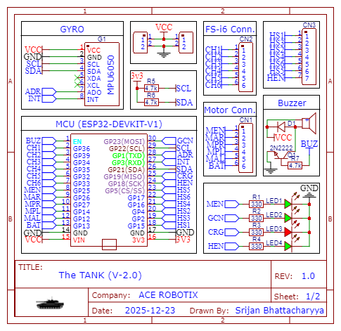
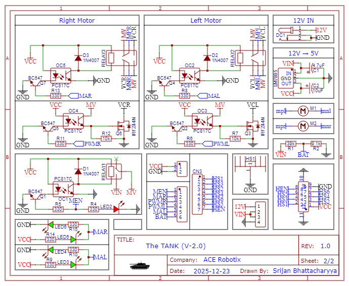
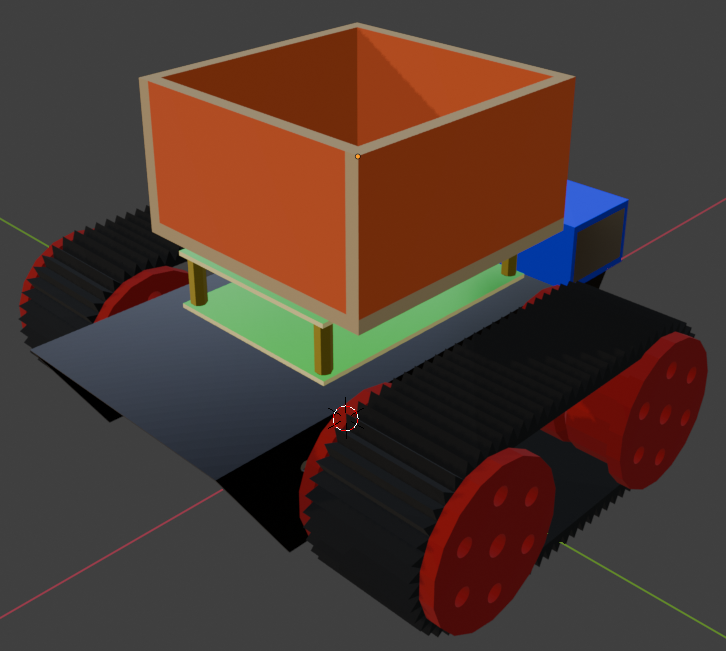
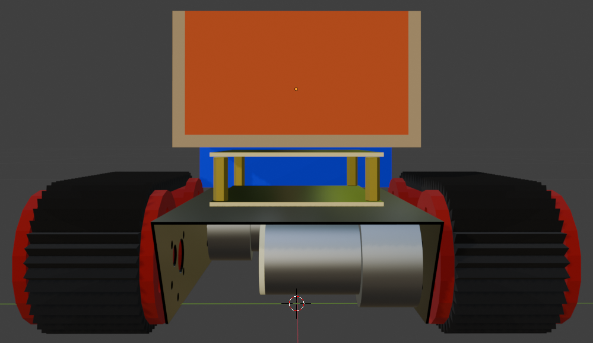
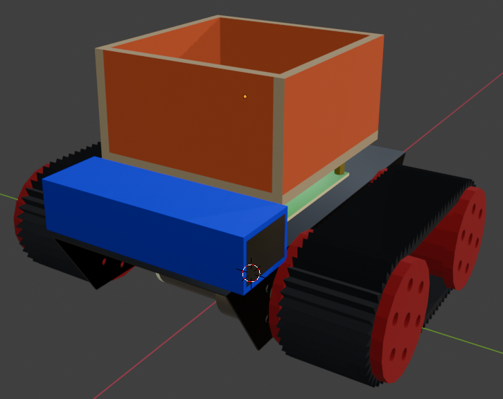
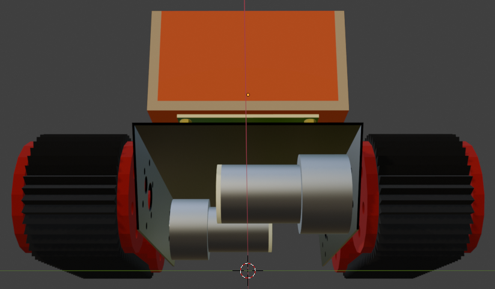

<link rel="stylesheet" href="README.css">

#  SAND ROVER 

## List Of Materials

| Item Name                           | Price Per Unit (₹) | Quantity | Total Price (₹) |
| :---------------------------------- | :----------------- | :------- | :-------------- |
| Johnson Orange Grade-A Geared Motor | 400                | 2        | 800             |
| ESP32-DevKit-V1                     | 250                | 1        | 250             |
| Caterpillar Track                   | 100                | 2        | 200             |
| Rover Body                          | 500                | 1        | 500             |
| Verro Board                         | 75                 | 2        | 150             |
| 3D Printed Wheel                    | 0                  | 4        | 0               |
| 12V 2200MAh Battery                 | 900                | 1        | 900             |
| FS-i6 Controller and Receiver       | 3600               | 1        | 3600            |
| M3 Stand-Offs                       | 9                  | 4        | 36              |
| M3 Screws                           | 10                 | 20       | 200             |

## Electronics

- The bot is of `19x21x13 cm` [`LxBxH`], weighing `≈ 1.7 KG`, powered by a `12V 2200mAh Lipo 3S` battery pack, featuring 2x PCBs, one for the MCu, while the other for controlling the motors and converting `12V` to stable `5V`.
- The PCB with the MCU `ESP32-DevKit-V1` is the brain of the bot, responsible for controlling the direction and speed of the motors. It will also have some LEDs for debugging purpose.
- The **FS-i6 Remote** will be used to manual control of the bot through a 4 channel connection, which will then be read and analyze by the MCU, and be forwarded to the motor driver PCB for execution.
- **The Motor Driver PCB** wil also be responsible for converting the 12V from `VIN` and then converting it to 5V (`VCC`) by `LM7805`, which whill be transfered to the MCU board and will also be used to power `FS-i6 Transceiver`.

## Schematics

  
   
  

## Diagram of the Bot and Dimensions

The dimensions of the various components of the bot are as follows-

- The chessis has dimensions of `19x9.5x4 cm` and a thickness of `1 mm`.
- The wheels have dimensions of `7.5x4 cm`.
- The wooden box has dimensions of `10x10x5.5 cm` and a thickness of `3 mm`.
- The total body of the bot has dimensions of `19x21x13 cm` and a thickness of `3 mm`.
- The track belt width is `4cm`.

 

